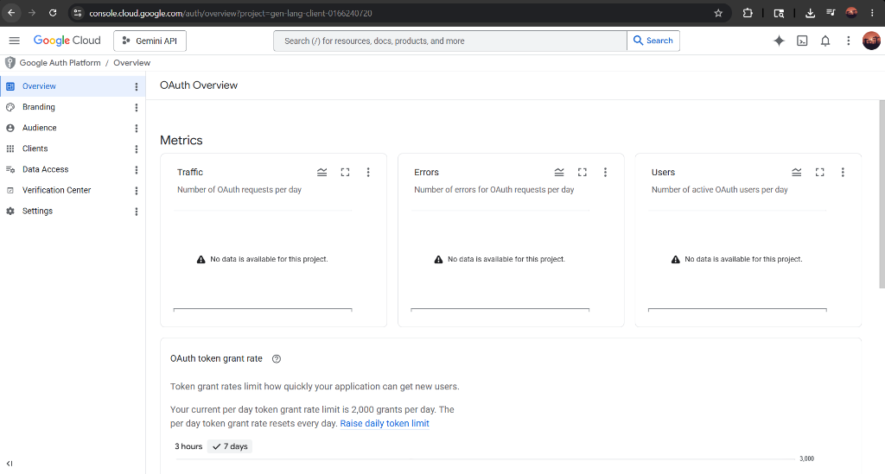
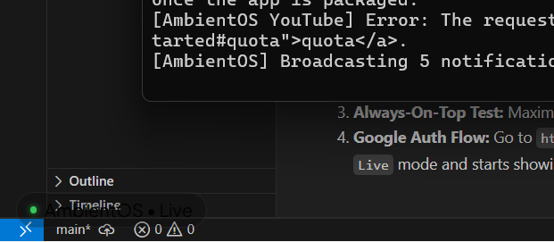

# AmbientOS

> **Sleek, Apple-Inspired Ambient Desktop Overlay** -- Tiny animated pink paper planes fly across your desktop, carrying beautiful floating notifications from your Google Calendar, Gmail, and YouTube.

---

## Screenshots






---

## Quick Start (Super Simple)

Setting up AmbientOS on your laptop takes less than a minute!

### Step 1: Setup and Run
1. Open the AirplaneMessanger folder.
2. Right-click **`setup.bat`** and select **Run as Administrator**.
3. AmbientOS will install everything and start running automatically in the background.

### Step 2: Connect Your Google Account
Once running, connect your Google account to see your real notifications:
1. Open your web browser and go to: **[http://localhost:3000/auth](http://localhost:3000/auth)**
2. Click **Sign in with Google** and approve the permissions.
3. Your screen will now dynamically display notifications for:
   * Google Calendar (upcoming meetings and events)
   * Gmail (unread inbox messages)
   * YouTube (new uploads from channels you subscribe to)

---

## How to Control AmbientOS

* **Launch Anytime:** Double-click **`launch.bat`** to start it manually.
* **Run silently on Startup:** The setup script automatically registers AmbientOS to start quietly in the background every time you turn on your laptop. No windows, no clutter!
* **Close / Stop the App:** To fully close the background overlay, open your Command Prompt (CMD) and run:
  ```cmd
  taskkill /f /im node.exe /im electron.exe
  ```

---

## Advanced Options and Developer Settings

<details>
<summary><b>Click to expand Advanced Settings (Google Cloud API and Git Guidelines)</b></summary>

### Google Cloud API Setup
To fetch live personal notifications, AmbientOS needs a `credentials.json` file in the folder.
1. Go to the [Google Cloud Console](https://console.cloud.google.com).
2. Enable these three APIs:
   * Google Calendar API
   * Gmail API
   * YouTube Data API v3
3. Create an **OAuth client ID** configured as a **Desktop App**.
4. Download your client secrets JSON file, place it in this folder, and rename it exactly to `credentials.json`.
5. Run the authentication flow at `http://localhost:3000/auth`. It will save your local session as `token.json` so you never have to log in again!

---

### Safe Git Workflows
This repository has Git initialized. The local `.gitignore` is pre-configured to keep your private API access keys secure.

* **Never Share or Commit:**
  * `token.json` (your active Google login token)
  * `credentials.json` (your Google API keys)

* **To save your custom style changes:**
  ```bash
  git add public/script.js public/style.css
  git commit -m "My custom styling update"
  ```

---

### 100x YouTube Quota Optimization
Standard YouTube requests can drain your free daily API quota within minutes. AmbientOS prevents this by extracting the channel uploads directly from their default `UU` playlist instead of using general search calls. This drops subscription scanning costs from **100 units to only 1 unit per check**, keeping it running forever without lockouts!

</details>
